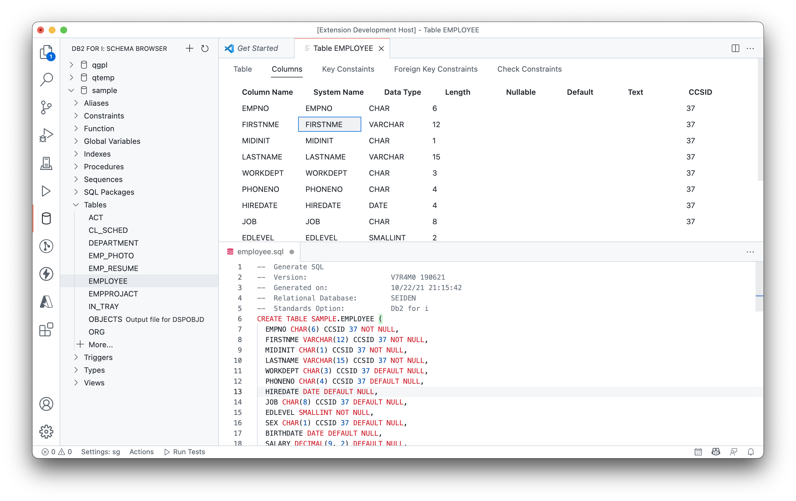

# vscode-db2i

Db2 for IBM i tools provides SQL functionality to VS Code. **It is in preview right now**.

* Schemas view
* Language tools. List tables and views and their columns when writing SQL, as well as procedures and functions
* Language validator* (must be enabled in VS Code settings)

\* *must be enabled in the settings*

## Want to help?

See the [Projects](https://github.com/halcyon-tech/vscode-db2i/projects) tab to see our progress and what you could work on.

### Help with Built-in function snippets

* `./src/language/*.code-snippets` will be used to defined all available functions and variables in Db2 for i.
* This is used to make writing SQL, and having access to all globals, easy.
* We simply need a new snippet object for each function or variable.

### Help with Schemas tool views.

* Each object type in the tree list has a Defintion View (by clicking on the object). Each Definition View exists in it's own folder. For example the table definition exists at `./src/panels/table`. This means other types will get their own folder for their Definition View. Views might be `./src/panels/view` and procedures might be `./src/panels/procedure`.
* Each object type has a class in the `./src/database` folder. For example, the table Definition View has the class `./src/view/table.js` which has all the methods needed to fetch information for that view. You may also add other static methods which could be used for commands specific to the table. Other objects would also get their own class.
* **The best example to work from is `src/panels/view/index.js`.**

## Building from source

1. This project requires VS Code and Node.js.
2. fork & clone repo
3. `npm i`
4. 'Run Extension' from vscode debug.