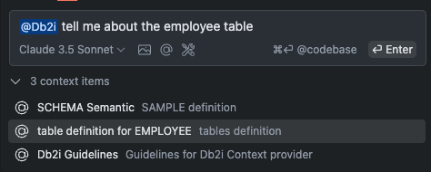

# Db2 for i Context Provider Developer Guide

This document provides a guide for prompt engineering for Db2 for i. More specifically, how we construct prompts for both Continue and Copilot AI extensions. 

## Key Concepts

A key component of the Db2 for i Code Assistant is the ability to provide contextually relevant information about a users Db2i connection and schema. This is done through something called a context provider. 

A context Provider does the following:
- Gathers relevant database information such as table information, column information, based on the user's prompt
- Creates additional "context items" or messages with the information gathered
- Builds a prompt with the context items that is then sent to the AI extension (Continue or Copilot)

Example for the following user input:
```
@Db2i how can I find the number of employees per department?
```

The context provider would gather information about the user's connection and schema, and then build a prompt with the following context items:
- current schema: `SAMPLE`
- table reference: `EMPLOYEE` and `DEPARTMENT`
- column reference: `EMPLOYEE.EMPNO`, `EMPLOYEE.LASTNAME`, `DEPARTMENT.DEPTNO`, `DEPARTMENT.DEPTNAME`, etc

## Continue and Copilot Parity

Both Continue and Copilot AI extensions have APIs for building prompts with context items. The APIs are similar but have some differences. It is important that the actual context items are identical in both extensions. 
- In Copilot, we register a `ChatParticipant`: `@Db2i` that is responsible for building the prompt with context items
- In Continue, we register a `ContextProvider`: `@Db2i` that is responsible for building the prompt with context items

**Note**: We refer to the `ChatParticipant` and `ContextProvider` as `@Db2i` in this document and we use "Context Provider" to refer to both. 

## Prompt formatting

The prompt format is very simple:

```plaintext
## Database Schema Definition

SCHEMA: [schema_name]
TABLES: [table_name_1], [table_name_2], ...

## Referenced Tables
TABLE: [table_name_1]
  - Columns:
    * [column_name]: [data type] [constraints/notes]
    * [column_name]: [data type] [constraints/notes]
  - Primary Key: [column(s)]
  - Foreign Keys: [if any, specify references]

TABLE: [table_name_2]
  - Columns:
    * [column_name]: [data type] [constraints/notes]
    * [column_name]: [data type] [constraints/notes]
  - Primary Key: [column(s)]
  - Foreign Keys: [if any, specify references]

-- (Repeat for all relevant tables)

## Database Guidelines

- [Guideline 1]
- [Guideline 2]
- [Guideline 3]
- ...

## Example

input: 
"Generate a SQL query to join the 'orders' and 'customers' tables to list all customers with their respective orders, including only orders with a total amount greater than 100."

### Expected Output Format

- Provide the complete SQL query.
- Include any assumptions as inline comments if needed.
- Format the query clearly and consistently.

[Insert the user's specific request here]

```

There are 4 main sections in the prompt:
- **Database Schema Definition**: This section provides the schema information for the user's connection. It includes the current schema and a list of tables in the schema.
- **Referenced Tables**: This section provides detailed information about the tables referenced in the user's query. It includes the columns, primary key, and foreign keys of each table.
- **Database Guidelines**: This section provides general guidelines for writing SQL queries based on the schema context. It includes style conventions, performance optimization tips, validation guidelines, and additional guidelines.
- **Example**: This section provides an example of the user's specific request and the expected output format.

The users input is inserted at the end of the prompt. This format allows a top down view of the database by providing the schema information first, followed by the reference tables, guidelines, and finally the user's specific request.

## Context Provider Implementation

In both Copilot and Continue, the same prompt format is followed. Here is an example of what that looks like in Continue:




